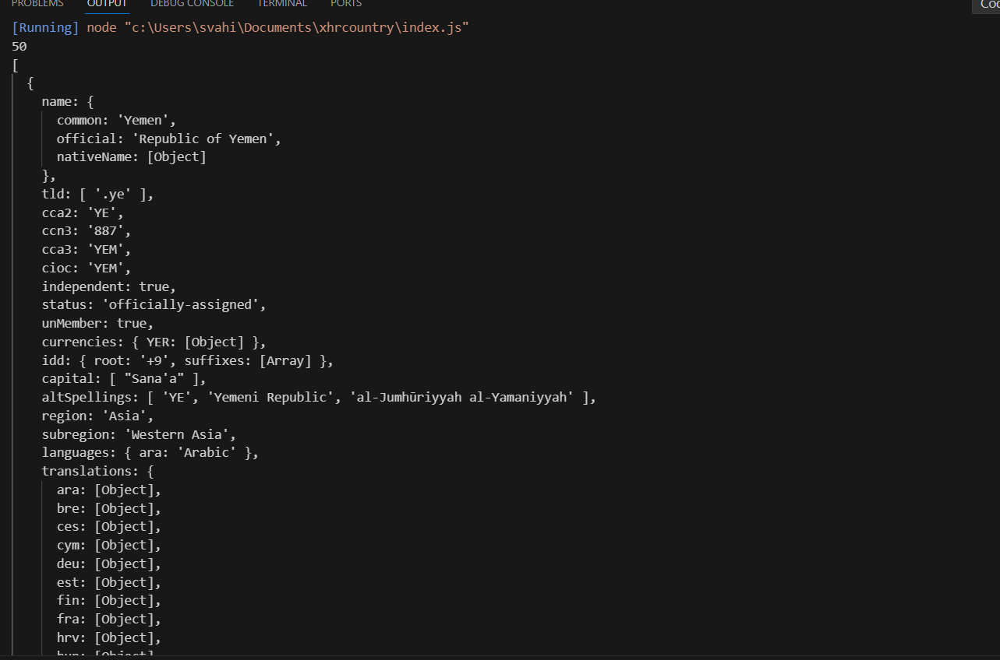
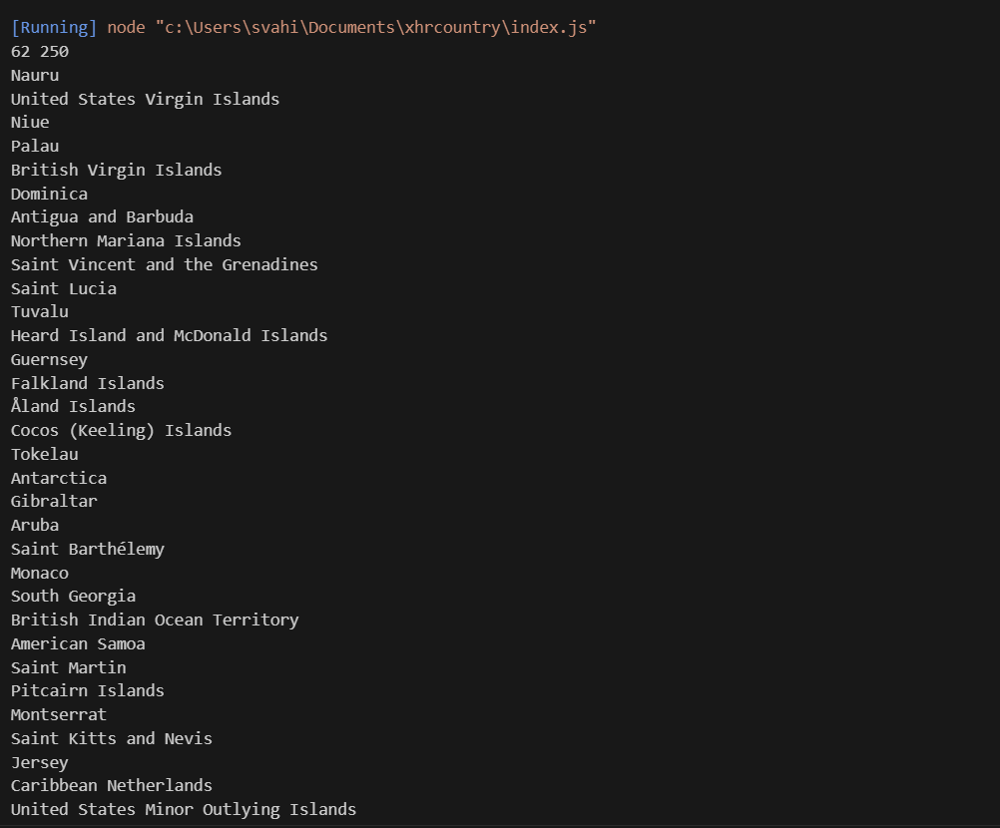
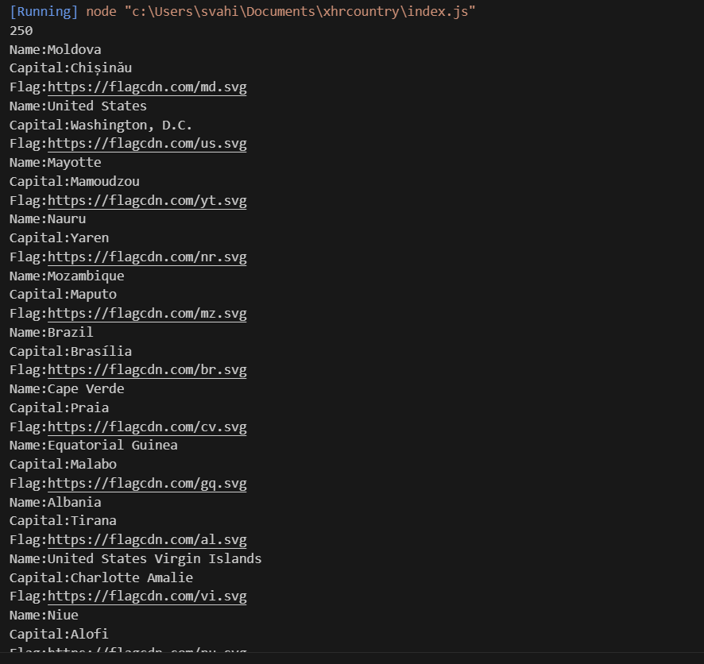
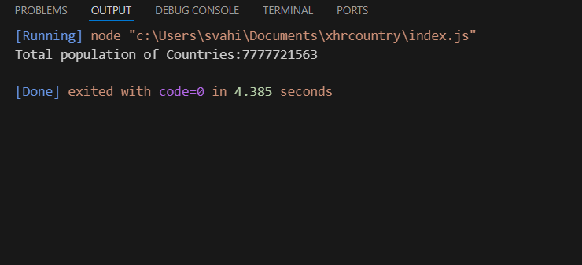
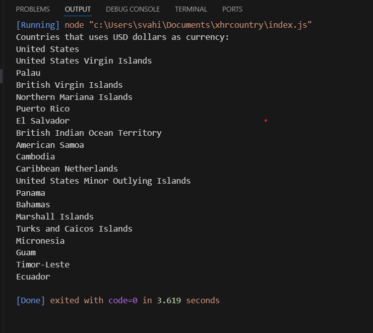

  This repository shows the output screenshots for the task (XHR).

## Task Description

Solving problems using array functions on **Rest countries API** data 

**API Endpoint:** https://restcountries.com/v3/all

**Library:** XHR2   

**Environment:** NodeJS

## Sub-Task 1

a. Get all the countries from `Asia continent/region` using filter function.

## Output Screenshots

## Sub-Task 2

b.Get all the countries with a `population of less than 2 lakhs` using filter function.

## Sub-Task 3

c. Print the following details `name, capital, flag using forEach function`.

## Sub-Task 4

d.Print the `total population` of countries using reduce function.

## Sub-Task 5

e. Print the country that uses `US dollars as currency`.

